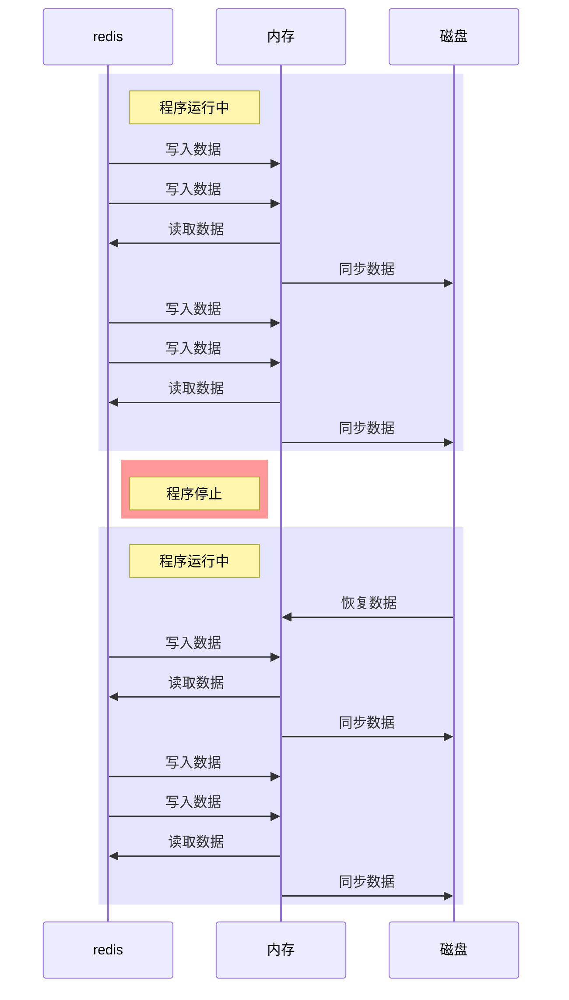
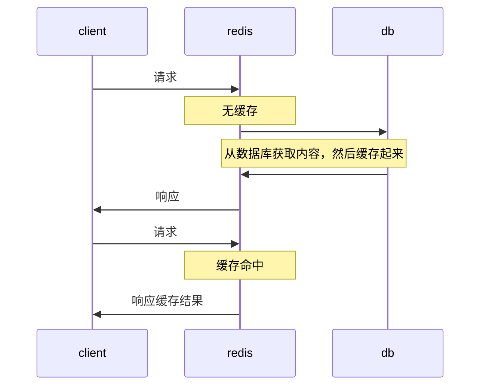
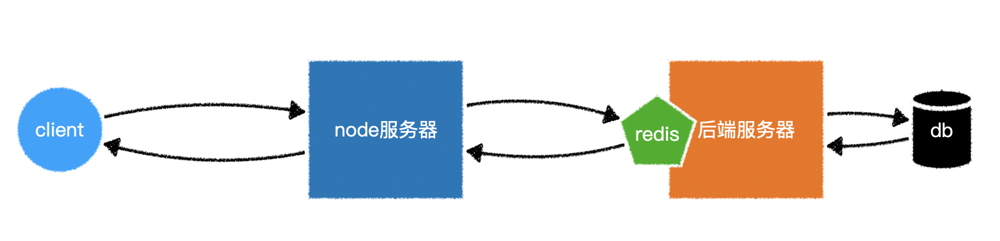
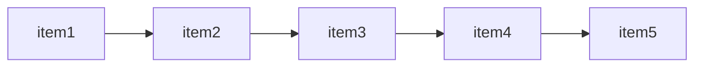

# redis 简介

> 官网：https://redis.io/
>
> 民间中文网：http://www.redis.cn/

`redis`是一个`键值对数据库`，属于`nosql数据库`的一种。

`redis`是开源系统，遵守`BSD开源协议`。

既然是键值对数据库，键自然是不可重复的，而值可以是

- 字符串 `String`，最常用的类型
- 哈希 `Hash`
- 列表 `list`
- 集合 `set` 
- 有序集合 `sorted sets`

有别于其他数据库，`redis`对数据的操作是在内存中完成的，因此：

- `redis`有着超高的读写效率
- `redis`会耗费大量内存，因此往往会搭建`redis`集群来解决内存不足的问题

尽管对数据的操作在内存中完成，但`redis`仍然提供了持久化的功能，在默认情况下，它使用异步的方式将数据写入到硬盘，以便重启之后从硬盘中恢复数据到内存



基于`redis`的这种特点，我们通常用它记录`缓存`



常用服务器结构：



# windows 中安装redis

1. 下载：https://github.com/microsoftarchive/redis/releases
2. 双击安装

# mac 中安装 redis

```shell
brew install redis # 安装redis
brew services start redis # 启动redis
brew services stop redis # 停止redis
brew services restart redis # 重启redis
```


# 可视化工具

 VSCode 插件 `Redis`
# 进入redis命令交互

无认证模式：

```shell
redis-cli # 默认进入本机redis命令交互
redis-cli -h <127.0.0.1> -p <6379>  # 进入其他主机redis命令交互
```

带认证模式：

```shell
# 设置认证密码
redis-cli # 进入redis命令交互
config set requirepass <密码> # 设置认证密码
config set requirepass "" # 取消认证密码     取消需要重启redis服务生效

# 使用认证密码进入
redis-cli -h <127.0.0.1> -p <6379> # 进入redis命令交互
auth <password> # 认证密码
```

> 使用 `ctrl + D` 或 `ctrl + C`  或 使用`quit`命令 退出命令交互

# 常用redis命令

## 通用

```shell
keys <pattern> # 得到满足条件的所有的key    keys * 表示得到所有的key

exists <keys...> # 确认指定的多个key有几个是存在的  exists a b c

type <key> # 得到key的类型

dbsize # 得到key的数量

ttl <key> # 得到一个key的过期时间, -1表示永不过期，-2表示key不存在

expire <key> <seconds> # 重新设置一个key的过期时间，单位秒

rename <oldkey> <newkey> # 重命名一个key

del <key> # 删除指定的key
```

默认情况下，`redis`会创建`16`个数据库

默认情况下，它会使用`0`号数据库存储键值对，除非有必要，否则不用去修改它

> 不同的数据库之间相互独立，因此可能出现重复的键

```shell
select <index> # 选择一个数据库编号  select 1 切换到1号数据库

flushdb # 删除当前数据库的所有key

flushall # 删除所有数据库的所有key
```

## 字符串

```shell
set <key> <value> [<TTL>] # 设置键值对，TTL为过期时间，单位秒，默认为-1，表示永不过期

get <key> # 获取某个键的值

mget <keys...> # 获取多个key的值

incr <key> # 将某个键的值自增1，前提条件是该键的值必须是数字

incrby <key> <number> # 将某个键的值自增指定的数量，前提条件是该键的值必须是数字

decr <key> # 将某个键的值自减1，前提条件是该键的值必须是数字

decrby <key> <number> # 将某个键的值自减指定的数量，前提条件是该键的值必须是数字
```

## list

`redis`中的`list`是一种从左到右的链表结构，左边是链表的头，右边是链表的尾



```shell
rpush <key> <value> # 向指定的key对应的链表尾部加入一个值

lpush <key> <value> # 向指定的key对应的链表头部加入一个值

llen <key> # 得到链表的长度

lrange <key> <start> <end> # 得到链表指定范围的值

lindex <key> <index> # 返回链表key中下标为index的值

lset <key> <index> <value> # 设置链表key下标为index的值

lrem <key> <count> <value> # 删除链表key中值为value的项，删除count个

lpop <key> # 删除链表的首元素

rpop <key> # 删除链表的尾元素
```


## hash

`hash`类型相当于把`redis`的某个值设置为对象

```shell
hset <key> <field> <value> # 设置对象key的属性

hget <key> <field> # 返回对象key的field属性值

hkeys <key> # 返回对象key中所有的键

hvals <key> # 返回对象key中所有的字段值

hgetall <key> # 返回对象key中所有的键值对

hexists <key> <field> # 对象key中是否存在指定的字段

hdel <key> <field> # 删除对象key中的指定字段

hlen <key> # 返回对象key中的字段数量
```
node-redis: https://github.com/NodeRedis/node-redis

```js
// 创建连接

// 1. 回调方式
const redis = require("redis");
const client = redis.createClient({
  host: "127.0.0.1",
  port: 6379,
  password: "认证密码"
});

// 通过 client 操作数据库
// 操作方式和 redis 原生方式基本一致
client.set("key", "value", (err, reply) => {
  
})

client.get("key", (err, reply) => {
  
})


// 2. promise 方式
const redis = require('redis')
const client = redis.createClient()

async function main() {
  await client.connect()
    client.on('connect', (error: any, result: any) => {
    console.log('Redis client connected', error, result)
  })
  const db = await client.select(2)
  console.log('Redis select db', db)
  const res = await client.set("name", "jack")

  const cache = await client.get("name1")
  console.log('Redis缓存==', cache)
  console.log('Redis set name', res)
}

main()

```

## 缓存响应体

```js
const redis = require('redis')
const client = redis.createClient()
async function runRedis() {
    client.on('connect', (error, result) => {
        console.log('Redis client connected', error, result)
    })
    await client.connect()
    const db = await client.select(1)
    const result = await client.flushAll()  // 清空redis 数据库
}
runRedis()


var express = require('express');
var app = express();
// app.use(express.static('./public'));
var port = 3000;
var router = express.Router();
app.use('/api', router);


// 中间件
function middleware(options = {}) {
    // 默认配置  isJson 是否是json数据  cacheTime 缓存时间秒EX
    const defaultOptions = {
        isJson: true,
        cacheTime: 10,
    }
    const { isJson, cacheTime } = { ...defaultOptions, ...options }
    return async (req, res, next) => {
        const key = req.originalUrl
        console.log('key', key);
        const content = await client.get(key)
        if (content) {
            const body = isJson ? JSON.parse(content) : content
            res.setHeader("Content-Type", isJson ? "application/json" : "text/plain");
            res.send(body)
            console.log('使用redis缓存');
        } else {
            // 存储服务器响应体  从写send方法 拦截send方法先存到redis 再调用原始方法返回给客户端
            const originalSend = res.send.bind(res)
            res.send = async function (body) {
                await client.setEx(key, cacheTime, isJson ? JSON.stringify(body) : body)
                originalSend(body)
            }
            next()
        }
    }

}
// 路由
router.get('/users', middleware(), function (req, res) {
    res.setHeader("Cache-Control","no-cache", "max-age=10");
    console.log('未使用redis缓存');
    res.send({
        name: 'Tommy',
        age: 20,
        sex: '男'
    });
});


app.listen(port, function () {
    console.log("Example app listening on port ".concat(port));
});
```

## 缓存session

```js
import session from 'express-session'
import { createClient } from 'redis'
import express from 'express'
import { RedisStore } from 'connect-redis'
const redisClient = createClient() // 创建Redis客户端
redisClient.connect().catch(console.error)  // 连接Redis服务器

const redisStore = new RedisStore({
    client: redisClient,
    prefix: "myapp:",
})


const app = express()
app.use(session({
    secret: 'secret1111',
    resave: false,  // 强制保存会话，即使会话没有被修改
    saveUninitialized: true, // 强制将未初始化的会话存储到存储中
    store: redisStore,
    name: 'my_session.sid', // 设置cookie的名称
    cookie: {
        maxAge: 1000 * 60, // 设置cookie有效期  1分钟  redis默认跟随cookie的过期时间
    },
}))

app.get('/a', (req, res) => {
    if (req.session.views) {
        req.session.views++
        res.send(`你已经访问了${req.session.views}次 `,)
    } else {
        req.session.views = 1
        res.send('欢迎首次访问')
    }
})

app.get('/b', (req, res) => {
    res.send(req.session)
})


app.listen(3000, () => console.log('Server running on port 3000'))


```

