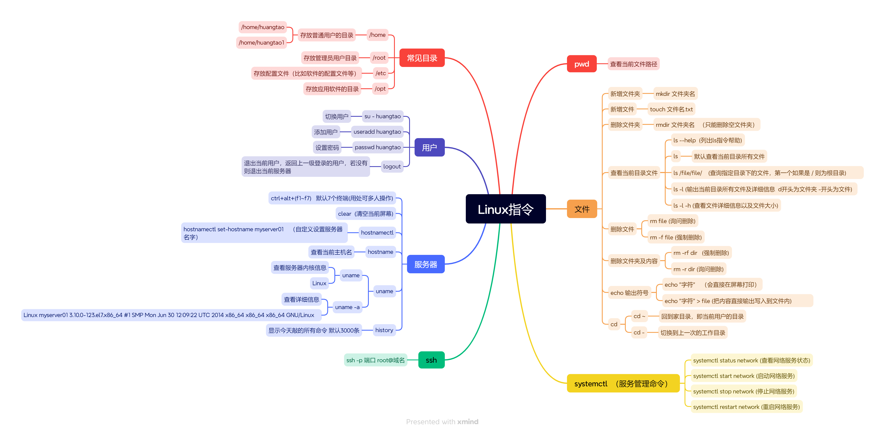

# Linux指令
## pwd
### 查看当前文件路径
## 文件
### 新增文件夹
- mkdir 文件夹名
### 新增文件
- touch 文件名.txt
### 删除文件夹
- rmdir 文件夹名   （只能删除空文件夹）
### 查看当前目录文件
- ls --help  (列出ls指令帮助)
- ls
  - 默认查看当前目录所有文件
- ls /file/file/    (查询指定目录下的文件，第一个如果是 / 则为根目录)
- ls -l (输出当前目录所有文件及详细信息  d开头为文件夹 -开头为文件)
- ls -l -h (查看文件详细信息以及文件大小)
### 删除文件
- rm file (询问删除)
- rm -f file (强制删除)
### 删除文件夹及内容
- rm -rf dir   (强制删除)
- rm -r dir (询问删除)
### echo 输出符号
- echo "字符"    （会直接在屏幕打印）
- echo "字符" > file (把内容直接输出写入到文件内)
### cd
- cd ~
  - 回到家目录，即当前用户的目录
- cd -
  - 切换到上一次的工作目录
## systemctl  （服务管理命令）
### systemctl status network (查看网络服务状态)
### systemctl start network (启动网络服务)
### systemctl stop network (停止网络服务)
### systemctl restart network (重启网络服务)
## ssh
### ssh -p 端口 root@域名
## 服务器
### ctrl+alt+(f1~f7)   默认7个终端(用处可多人操作)
### clear  (清空当前屏幕)
### hostnamectl
- hostnamectl set-hostname myserver01    （自定义设置服务器名字）
### hostname
- 查看当前主机名
### uname
- uname
  - 查看服务器内核信息
  - Linux
- uname -a
  - 查看详细信息
  - Linux myserver01 3.10.0-123.el7.x86_64 #1 SMP Mon Jun 30 12:09:22 UTC 2014 x86_64 x86_64 x86_64 GNU/Linux
### history
- 显示今天敲的所有命令 默认3000条
## 用户
### su - huangtao
- 切换用户
### useradd huangtao
- 添加用户
### passwd huangtao
- 设置密码
### logout
- 退出当前用户，返回上一级登录的用户，若没有则退出当前服务器
## 常见目录
### /home
- 存放普通用户的目录
  - /home/huangtao
  - /home/huangtao1
### /root
- 存放管理员用户目录
### /etc
- 存放配置文件（比如软件的配置文件等）
### /opt
- 存放应用软件的目录

<!-- 图片 -->
## Linux思维导图
